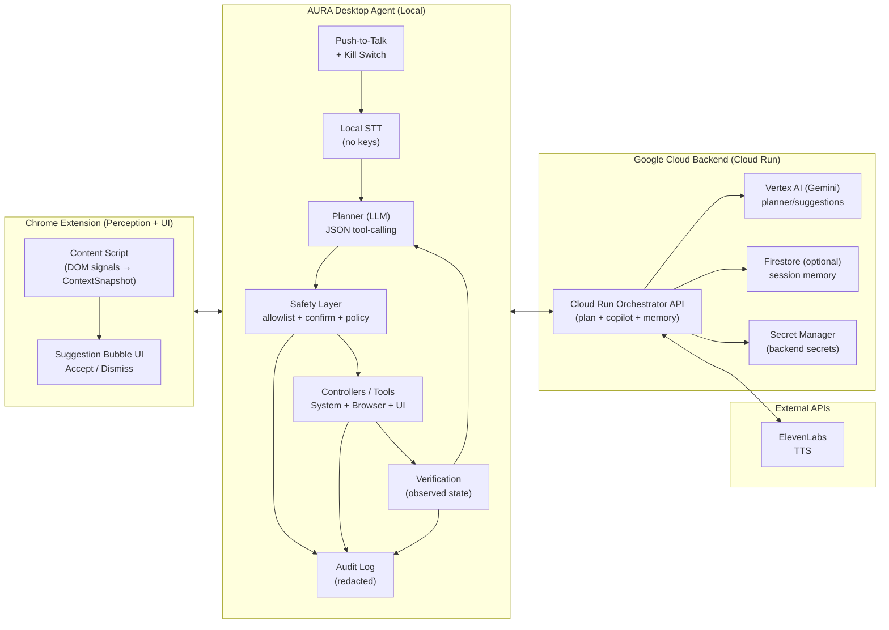

# AURA — Context‑Aware Copilot (Browser + Computer Control)

AURA is a “Siri‑like” assistant that can **help inside the browser** and (optionally) **take real actions on the user’s computer**—reliably and safely.

This repo is currently **design‑first**: it documents how we’ll build AURA into reality, which credentials/permissions are needed, and how we’ll test every feature **before writing the full product code**.

---

## Product Modes

### 1) Copilot mode (unsolicited, minimal interruptions)

Runs mostly in the browser:
- Observes **structured visible context** (no screenshots for MVP)
- Detects friction (pauses, repeated edits, tab oscillation, unanswered required fields)
- Intervenes only when helpful, with grounded explanations

### 2) Action mode (explicit user command → computer control)

Runs locally on the user’s machine (push‑to‑talk in v1):
- Speech → text → plan → **structured tool calls**
- Executes actions via deterministic controllers (OS APIs, Accessibility, DOM, Playwright)
- **Verifies after every action**
- Asks when ambiguous; confirms destructive actions; includes a kill switch

Important safety stance: **Copilot mode can suggest; Action mode can do.** We don’t silently perform risky OS actions without explicit intent.

---

## High‑Level Architecture (Local‑First, Cloud‑Assisted)

Key rule: **tool execution and safety enforcement happen locally**. Cloud services can assist with planning/memory, but never directly “remote control” the machine.

Project requirement note: this build will include a **Google Cloud backend (Cloud Run)** that calls **Vertex AI (Gemini)** so we can provide proof the backend is running on GCP.



---

## Chosen Stack (For This Build)

- **Backend (required):** Google Cloud Run + **Vertex AI (Gemini)** endpoints (meets the “proof of GCP deployment” requirement)
- **Speech:** **Local STT via `whisper.cpp`** (no keys) + **ElevenLabs** for TTS **via Cloud Run** (so `ELEVENLABS_API_KEY` never lives on the user’s device)
- **Browser control:** Chrome extension **plus Playwright** (extension for “in the user’s current tab”; Playwright for deterministic scripted flows)

## Deterministic Control Strategy (How We Avoid “Vision Clicking”)

We always prefer the most deterministic control surface:

1. **Structured APIs (preferred)**
   - File operations via OS APIs
   - Browser via DOM (extension) or Playwright locators
2. **Accessibility UI automation**
   - Find controls by role/name, click menu items, set field values
3. **Vision fallback (last resort)**
   - Screenshot → locate target → click coordinates
   - Used only when (1) and (2) fail, and guarded by extra safety rules

---

## Core Tooling (Action Mode)

### Tool contract (verification-first)

Every tool returns:

```json
{
  "success": true,
  "observed_state": "Finder is frontmost; created folder 'Invoices' in ~/Documents; verified exists.",
  "error": null
}
```

The planner must **not** assume success. It reads `observed_state` and decides the next step (retry, alternative, or ask a question).

### Tool schema (MVP set)

System (macOS):
- `open_app(name)`
- `open_path(path)`
- `open_url(url)`
- `search_files(query, root_paths?)`
- `create_folder(path)`
- `rename_path(from, to)`
- `move_path(from, to)`
- `trash_path(path)` (always requires confirmation)

Browser:
- **DOM-first (extension):**
  - `browser_click_text(text)`
  - `browser_type_active(text)`
  - `browser_extract_visible_text()`
  - `browser_get_active_url()`
- **Playwright (optional deterministic flows):**
  - `browser_new_tab()`, `browser_go(url)`, `browser_search(query)`, `browser_click_result(index)`

UI (Accessibility):
- `focus_app(name)`
- `click_menu(menu_path[])`
- `click_role(name, role)`
- `type_text(text)`
- `press_key(keys[])`

Safety:
- `confirm_action(reason)` (required for destructive/irreversible operations)
- `abort(reason)` (kill switch / safe stop)

---

## Data Models

### `ContextSnapshot` (from extension → desktop agent)

Structured only; sanitized locally before leaving the page.

```ts
type ContextSnapshot = {
  session_id: string;
  url: string;
  domain: string;
  page_type: "article" | "form" | "product" | "editor" | "search" | "other";

  page_title: string;
  visible_text_chunks: Array<{
    id: string;
    text: string; // truncated + sanitized
    source: "h1" | "p" | "li" | "label" | "other";
  }>;

  active_element: null | {
    kind: "input" | "textarea" | "contenteditable" | "select";
    label: string;
    input_type?: string;
    value_length?: number; // length only for sensitive fields
  };

  form_fields: Array<{
    field_id: string;
    label: string;
    kind: "input" | "textarea" | "select";
    input_type?: string;
    required?: boolean;
    is_sensitive: boolean;
    answered: boolean;
  }>;

  user_actions: Array<
    | { type: "cursor_idle"; ms: number }
    | { type: "tab_switch"; from_domain: string; to_domain: string }
    | { type: "text_edit_burst"; count: number }
    | { type: "selection"; chars: number }
  >;

  hesitation_score: number;
  tab_cluster_topic?: string;
  timestamp: string; // ISO-8601
};
```

### Desktop observed state (for verification)

```ts
type DesktopState = {
  os: "macos";
  frontmost_app: string;
  frontmost_window_title?: string;
  active_url?: string; // if browser is detectable
  recent_actions: Array<{ tool: string; ok: boolean; ts: string }>;
};
```

---

## Planner Outputs (Two Schemas)

### Copilot mode output (suggestion only)

```json
{
  "intervene": false,
  "reason": "Not enough friction; user is scrolling normally.",
  "response": "",
  "ui_action": null
}
```

### Action mode output (tool calls)

```json
{
  "goal": "Rename the PDF to include the date",
  "questions": [],
  "tool_calls": [
    { "name": "search_files", "args": { "query": "Report.pdf", "root_paths": ["~/Documents"] } },
    { "name": "rename_path", "args": { "from": "~/Documents/Report.pdf", "to": "~/Documents/Report-2026-02-26.pdf" } }
  ]
}
```

We enforce strict JSON schema validation; malformed model output fails closed (no action).

---

## Safety & Privacy (Non‑Negotiables)

- **No secrets in the Chrome extension.**
- **Local filtering** in extension + **server/local re-checks** (defense-in-depth).
- **Sensitive fields never sent** (passwords, credit cards, SSNs, hidden DOM fields).
- **Domain allow/deny lists** (disable on auth/banking/health by default).
- **Confirmation prompts** for destructive actions (delete/trash/move sensitive files).
- **Ask when ambiguous** (multiple matches, unclear target app/window/file).
- **Kill switch** hotkey stops execution immediately.
- **Audit logs** are redacted and stored locally; cloud logging is opt-in.

---

## Credentials / API Keys / Secrets Needed

This build uses **Cloud Run + Vertex AI** and **ElevenLabs**. We keep secrets out of the Chrome extension.

Recommended secret storage:
- **Cloud Run:** Google Secret Manager
- **Desktop agent:** OS keychain (or local `.env` for dev only)

### Google Cloud (required)

GCP resources:
- **Cloud Run** service (the orchestrator backend)
- **Vertex AI** enabled (Gemini model access)
- (Optional) **Firestore** for session memory
- **Secret Manager** for storing backend secrets

Cloud Run service account permissions (minimum starting point):
- Vertex AI invoke (Gemini)
- Secret Manager access for required secrets
- (Optional) Firestore read/write

Backend env vars (Cloud Run):

```bash
GOOGLE_CLOUD_PROJECT="your-gcp-project-id"
GOOGLE_CLOUD_REGION="us-central1"

AURA_GEMINI_MODEL="(Gemini model id on Vertex AI)"

# Optional memory
AURA_FIRESTORE_SESSIONS_COLLECTION="sessions"
AURA_FIRESTORE_EVENTS_COLLECTION="events"

# Safety + ops
AURA_SENSITIVE_DOMAIN_BLOCKLIST="accounts.google.com,bankofamerica.com,chase.com"
AURA_LOG_LEVEL="info"
```

Desktop agent env vars (local):

```bash
AURA_BACKEND_URL="https://<cloud-run-service-url>"
AURA_BACKEND_AUTH_TOKEN="(shared token or auth config for backend)"
```

### Local STT (no keys)

Local STT keeps raw audio on-device and avoids cloud STT keys.

Chosen implementation: **`whisper.cpp`**
- Pros: consistent offline transcription, good accuracy for push‑to‑talk commands
- Tradeoffs: model download/size and local CPU usage

Operational notes (design intent):
- Ship a small default model (or download on first run) and allow users to switch models for accuracy vs speed.
- Store model weights locally and never upload raw audio as part of STT.

### ElevenLabs (TTS)

Secrets (store in Secret Manager if Cloud Run performs TTS; otherwise store locally for dev only):
- `ELEVENLABS_API_KEY`

Common configuration:
- `ELEVENLABS_VOICE_ID`
- `ELEVENLABS_MODEL_ID` (optional)

Notes:
- If we route TTS through Cloud Run, the **ElevenLabs key never lives on the user’s device**.
  - This build will route TTS via **Cloud Run**: Desktop agent → `POST /tts` → Cloud Run → ElevenLabs → audio bytes → Desktop agent.

### Proof of Google Cloud Deployment (Requirement)

We’ll satisfy this in two ways:

1. **Screen recording proof (recommended):**
   - Show the Cloud Run service in the GCP Console and a live request hitting it (logs/metrics), and optionally a request ID that correlates with the desktop agent action.
2. **Repo proof (once code is added):**
   - Include a backend module that calls **Vertex AI Gemini endpoints** from Cloud Run (e.g., `backend/src/vertex.ts`), demonstrating direct use of Google Cloud services/APIs.

---

## GCP Backend Responsibilities (Cloud Run Orchestrator)

The Cloud Run backend is the “thinking/memory” service, not the actuator.

Proposed endpoints (shape can change, but keep them explicit and testable):
- `GET /healthz` → uptime checks
- `POST /copilot` → input: `ContextSnapshot`; output: copilot JSON (`intervene/reason/response/ui_action`)
- `POST /plan` → input: instruction + `DesktopState` (+ optional `ContextSnapshot`); output: tool-call plan JSON
- `POST /tts` → input: text; output: audio bytes via ElevenLabs (key in Secret Manager)

Hard requirements enforced on backend:
- strict request/response schema validation
- content limits + redaction of sensitive fields
- rate limits per session/device
- logs contain no secrets and no sensitive form values

---

## Local Permissions (macOS Demo Requirements)

To operate the computer on macOS, the desktop agent will request:

- **Microphone** (push‑to‑talk)
- **Accessibility** (UI automation)
- **Automation / Apple Events** (if controlling specific apps via Apple Events)
- **Screen Recording** (only if enabling vision fallback)
- **Files & Folders / Full Disk Access** (only if file search spans protected locations)

We fail closed if required permissions are missing.

---

## Testing Strategy (How We Prove Each Feature Works)

Guiding rule: **mock the model for determinism**, then run a small number of live-model smoke tests.

### 1) Extension: context capture + privacy filtering

Test:
- Visible text extraction is sanitized + size-limited
- Form parsing captures labels/types/required fields
- Sensitive inputs are detected and excluded

How:
- Unit: JSDOM fixtures
- E2E: Playwright/Puppeteer + extension runner against local HTML fixtures

### 2) Desktop agent: planner + schema enforcement

Test:
- Tool-call JSON validates
- Disallowed tools/args are blocked
- Ambiguity triggers questions, not actions

How:
- Unit: golden tests (“instruction → tool_calls” with a mocked LLM)
- Contract: invalid JSON → no action

### 3) System controller (files/apps/urls)

Test:
- Open app/path/url works and is verified
- File operations are correct and reversible where possible
- Trash/delete always requires confirmation

How:
- Integration: run against temp directories; assert filesystem state after each tool

### 4) Browser controller (extension + Playwright)

Test:
- Navigation, search, click, extract text is stable
- Verification reads active URL and page-ready signals

How:
- Integration/E2E: Playwright tests with known sites/fixtures (plus local HTML pages)

### 5) Cloud Run backend (Vertex AI orchestration)

Test:
- Request/response schemas are enforced (invalid input → 4xx; invalid model output → fails closed)
- Redaction + safety policies are applied server-side (no sensitive fields stored or logged)
- Vertex AI calls work in a controlled way (timeouts, retries, rate limits)

How:
- Unit: schema validation + policy tests with a mocked Vertex client
- Integration: container-local backend tests (no network) + an optional “deployed smoke test” flag that hits the live Cloud Run URL

### 6) Accessibility controller (UI automation)

Test:
- Focus app/window, click menu items, type text, press keys
- Post-condition verification (frontmost app, UI element existence where possible)

How:
- Local E2E harness (manual + scripted) using a small “test app”/fixture window
- CI uses mocked accessibility tree where feasible (real UI automation is hard in headless CI)

### 7) Voice loop (push‑to‑talk → STT → plan → execute → TTS)

Test:
- Push‑to‑talk toggles reliably
- STT produces expected transcript on prerecorded audio
- Full loop succeeds on demo commands and stops safely on kill switch
- TTS produces playable audio for responses (via ElevenLabs through Cloud Run; stubbed in CI)

How:
- E2E: prerecorded audio fixtures + mocked STT for CI + a live STT smoke test flag

---

## 4‑Week Build Timeline (Reliable Demo in 1 Month)

### Week 1 — Core loop
- Push‑to‑talk + kill switch
- Desktop agent skeleton (tools + verification + local audit log)
- Cloud Run backend skeleton (`/healthz`, `/plan`)
- Vertex AI (Gemini) planning call + strict JSON schema validation
- `whisper.cpp` local STT integration (offline, no keys)
- ElevenLabs TTS path via backend `/tts` + Secret Manager, plus local dev stubs
- `open_app`, `open_path`, `open_url` + verification

### Week 2 — Browser control (critical unlock)
- Extension ↔ desktop agent bridge (localhost)
- DOM-first browser tools + verification
- Playwright runner for deterministic scripted flows (search/click/extract)

### Week 3 — OS interaction (macOS)
- File tools (create/rename/move) + confirm gates
- Accessibility controller basics (focus/menu/type)

### Week 4 — Reliability + safety
- Ambiguity questions + confirmations
- Retries/timeouts + safe abort
- Action history UI (“what I did”)
- Golden scenario suite + live-model smoke tests

---

## Next Step (When You’re Ready)

Decisions locked for this build:
- Vertex AI (Gemini) via **Cloud Run** on Google Cloud
- **Local STT via `whisper.cpp`** (no keys) + **ElevenLabs** for TTS via **Cloud Run**
- Chrome extension **+ Playwright**

If you give the go‑ahead to start coding, we’ll scaffold:
1) `/backend` Cloud Run service (Vertex AI + schema validation + `/healthz`)  
2) `/desktop` agent loop (tool schema, safety gates, verification, local logs)  
3) `/extension` snapshot capture + suggestion UI + localhost bridge  
4) A deterministic test harness (mock model + golden scenarios + Playwright E2E)  
