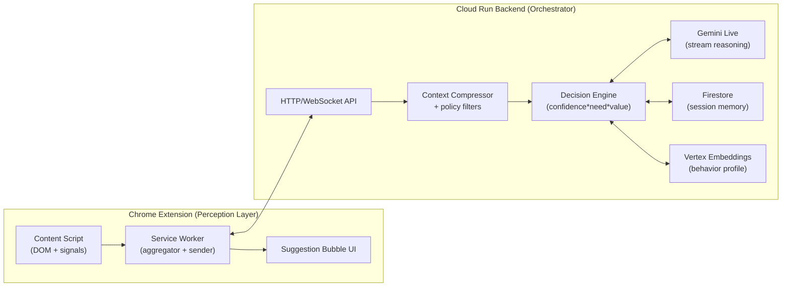

# AURA for Chrome — Context-Aware Web Copilot

AURA is a real-time browser copilot that infers what a user is trying to do (researching, applying, writing, comparing, purchasing) from **structured, visible context** and only intervenes when help is likely to be useful.

This repository is currently **design-first**: it documents the intended implementation, required credentials, and how we will test each feature before writing code.

---

## What AURA Does (MVP)

- Captures **structured browser signals only** (no screenshots for MVP):
  - page title, domain, URL
  - visible text chunks (sanitized/filtered)
  - form field labels + types (excluding sensitive/private inputs)
  - cursor inactivity / hesitation signals
  - tab switching patterns and “oscillation”
  - repeated edits (editor-like pages)
  - highlighted text (user selection)
- Streams context snapshots every **3–5 seconds** (adaptive: slower when idle, faster during friction).
- Runs an **intervention decision engine** that outputs:
  - `intervene: boolean`
  - `reason: string` (grounded in the snapshot)
  - `response: string` (short + actionable)
  - `ui_action?: { type, payload }`
- Displays a minimal suggestion bubble in-page with **Accept / Dismiss** feedback.
- Stores short-term session memory in Firestore; optionally builds long-term preferences via embeddings.

Non-goals for MVP:
- No raw keystroke streaming
- No password / credit card / SSN collection
- No hidden DOM fields
- No always-on mic (voice is a stretch goal)

---

## High-Level Architecture



Key design choice: the extension does **local filtering** before sending anything to the backend, and the backend re-applies policies (defense-in-depth).

---

## Data Model

### `ContextSnapshot` (sent from extension → backend)

```ts
type ContextSnapshot = {
  session_id: string;
  url: string;
  domain: string;
  page_type: "article" | "form" | "product" | "editor" | "search" | "other";

  // Structured + sanitized; never raw screenshots
  page_title: string;
  visible_text_chunks: Array<{
    id: string;                 // stable-ish across snapshots
    text: string;               // truncated + sanitized
    source: "h1" | "p" | "li" | "label" | "other";
  }>;

  active_element: null | {
    kind: "input" | "textarea" | "contenteditable" | "select";
    label: string;              // best-effort from nearby label/aria
    input_type?: string;        // "text" | "email" | "tel" | ...
    value_length?: number;      // length only (not the raw value) for sensitive fields
  };

  form_fields: Array<{
    field_id: string;           // DOM-derived stable id (hashed)
    label: string;
    kind: "input" | "textarea" | "select";
    input_type?: string;
    required?: boolean;
    is_sensitive: boolean;      // determined locally + verified server-side
    answered: boolean;          // value present (but value not sent if sensitive)
  }>;

  user_actions: Array<
    | { type: "cursor_idle"; ms: number }
    | { type: "tab_switch"; from_domain: string; to_domain: string }
    | { type: "text_edit_burst"; count: number }
    | { type: "selection"; chars: number }
  >;

  hesitation_score: number;     // computed locally or server-side
  tab_cluster_topic?: string;   // computed server-side from recent pages
  timestamp: string;            // ISO-8601
};
```

### Model I/O Contract (backend → Gemini Live)

Input: compressed snapshot JSON only (plus short session memory).

Output (strict JSON):

```json
{
  "intervene": true,
  "reason": "The user has paused for 18s on a required field labeled 'Describe your impact', and there are repeated edits.",
  "response": "Try a 2–3 sentence impact answer: ...",
  "ui_action": { "type": "show_bubble", "payload": { "anchor": "active_element" } }
}
```

We will enforce strict schema validation; malformed output becomes `intervene:false` with a logged parse error.

---

## Intervention Decision Engine (Implementation Plan)

We keep a **deterministic scoring layer** around the model to reduce hallucinations and interruptions:

1. **Intent inference**
   - Model classifies current goal: `researching | applying | comparing | writing | purchasing`
   - Must cite snapshot evidence (labels, headings, domain patterns).
2. **Friction detection**
   - `pause_ms` thresholds per page type
   - `tab_oscillation` across same topic cluster
   - `repeated_edits` in editors
   - `unanswered_required_fields` in forms
3. **Helpfulness scoring**
   - `confidence`: does the model understand context? (self-rated + heuristics)
   - `need`: friction score
   - `value`: estimated time saved (heuristic by page type + friction)
   - `intervention_score = confidence * need * value`
4. **Gating rules (hard stops)**
   - Sensitive domain blocklist (banking, healthcare, auth pages)
   - Sensitive field types (password, cc, ssn) => never send raw values; usually no intervention
   - Low confidence or missing grounding => silent
5. **Response shaping**
   - ≤ ~2 sentences by default
   - Must include a short grounding clause (“because this field asks for…”)
   - Offer an explicit action (rewrite, compare, summarize, clarify)

---

## Proposed Repository Layout (Once We Start Coding)

```text
/extension/                  # Chrome extension (TypeScript)
  /src/
  manifest.json
  vite.config.ts (or equivalent)

/backend/                    # Cloud Run service (TypeScript/Node)
  /src/
  Dockerfile

/infra/                      # IaC (optional): Terraform or gcloud scripts
/docs/                       # threat model, privacy, demo scripts
```

Technology choices (recommended for MVP):
- Extension: TypeScript + Vite, MV3 service worker, content scripts.
- Backend: Node.js (TypeScript) on Cloud Run; WebSocket or Server-Sent Events for streaming.
- Storage: Firestore (native mode).
- Embeddings: Vertex AI embeddings for long-term profile (optional for demo).
- Model: Gemini Live (streaming) via Google GenAI SDK on Vertex AI (recommended for server-side auth).

---

## Credentials / API Keys / Secrets Needed

This project is designed so **no secret API key is shipped inside the Chrome extension**.

### Required (Google Cloud / Vertex AI path — recommended)

These are not “API keys” but are required credentials:

1. **Google Cloud Project**
   - Enables: Cloud Run, Firestore, Vertex AI (Gemini + Embeddings)
2. **Cloud Run service account**
   - Permissions:
     - Firestore read/write (sessions + events)
     - Vertex AI invoke (Gemini) + embeddings
3. **Application Default Credentials (local dev)**
   - Use `gcloud auth application-default login` (preferred) OR
   - `GOOGLE_APPLICATION_CREDENTIALS=/path/to/service-account.json` (avoid if possible)

Recommended backend env vars:

```bash
GOOGLE_CLOUD_PROJECT="your-gcp-project-id"
GOOGLE_CLOUD_REGION="us-central1"

# Model configuration
AURA_GEMINI_MODEL="(streaming-capable Gemini model id)"
AURA_EMBEDDING_MODEL="(text embedding model id)"

# Firestore
AURA_FIRESTORE_SESSIONS_COLLECTION="sessions"
AURA_FIRESTORE_EVENTS_COLLECTION="events"

# Safety + ops
AURA_SENSITIVE_DOMAIN_BLOCKLIST="accounts.google.com,bankofamerica.com,chase.com"
AURA_MAX_VISIBLE_TEXT_CHARS="12000"
AURA_SNAPSHOT_RATE_LIMIT_PER_MIN="20"
AURA_LOG_LEVEL="info"
```

### Optional (Gemini Developer API path — only if NOT using Vertex AI)

If you choose to call Gemini via the Developer API (not recommended for Cloud Run production), you will need:

- `GEMINI_API_KEY` (secret)

Important: do **not** place `GEMINI_API_KEY` in the extension; the backend should own it.

### Optional (Client identity / user accounts)

For a demo, we can operate with anonymous sessions (`session_id`) and no user login.

For production-grade identity, one option is Firebase Authentication. This introduces:

- `FIREBASE_WEB_API_KEY` (not a secret, but required by client config)
- Firebase project configuration (auth domain, app id, etc.)

Alternative: Chrome Identity API + OAuth; still keep server-side session tokens.

### Optional (Ops/telemetry)

- `SENTRY_DSN` (client/server error reporting)
- `REDIS_URL` (rate limiting / queues; if we add it)

---

## Local Development Plan (No Code Yet)

Once code exists, local dev will look like:

1. Run backend locally (Docker or `node`):
   - serves `/snapshot` ingest endpoint
   - serves `/stream/:session_id` suggestions stream (WS/SSE)
2. Load extension unpacked in Chrome:
   - set backend URL in extension options
3. Visit demo pages:
   - form page (required fields + long pauses)
   - article (highlight + multi-tab summary)
   - editor (repeated edits)
   - product comparison (two product tabs)

---

## Testing Strategy (How We Ensure Each Feature Works)

We will test at **three levels**: unit, integration, and end-to-end (E2E). The guiding rule: *mock the model for determinism*, then run a small number of live-model smoke tests.

### 1) Extension: Context capture + privacy filtering

Features to test:
- Visible text extraction is limited, sanitized, and stable across snapshots.
- Form parsing captures labels/types/required-ness.
- Sensitive inputs are detected and excluded (password, credit card, SSN-like patterns).
- “Active element” identification works for input/textarea/contenteditable.

How we test:
- **Unit (Jest + JSDOM)**: feed synthetic DOM trees and assert the produced `ContextSnapshot`.
- **Property tests (optional)**: fuzz DOM structures; ensure no hidden fields or disallowed inputs leak.
- **E2E (Playwright/Puppeteer + extension runner)**:
  - load a local HTML fixture page with a form
  - type into fields and assert:
    - snapshots do not include sensitive values
    - `answered` flips true
    - `active_element.label` matches expected

Acceptance criteria:
- Zero sensitive values in emitted payloads
- Snapshot schema always validates locally

### 2) Extension: Friction signals

Features to test:
- Hesitation detection (`cursor_idle`, pause thresholds by page type).
- Repeated edits detection in editor pages.
- Tab switching events and “oscillation” recognition.

How we test:
- **Unit**: deterministic timers + synthetic events.
- **E2E**: scripted browsing flows that switch tabs and edit text; assert event counts and timestamps.

Acceptance criteria:
- `hesitation_score` increases when expected, stays low during normal reading

### 3) Backend: Ingest + validation + policy enforcement

Features to test:
- Snapshot schema validation and rejection of malformed payloads.
- Server-side policy re-checks (domain blocklist, sensitive fields).
- Context compression never exceeds configured limits.

How we test:
- **Unit**: schema validator tests + redaction tests.
- **Integration**: run backend locally; POST snapshots; assert stored/processed output.
- **Security regression tests**: snapshot containing “password” fields must be rejected/redacted.

Acceptance criteria:
- Invalid snapshots get 4xx with clear errors
- Policy violations become `intervene:false` (or rejected), never forwarded to the model

### 4) Backend: Decision engine (confidence * need * value)

Features to test:
- Friction scoring correctness across page types.
- Gating rules always override model suggestions.
- Intervention threshold behaves predictably.

How we test:
- **Unit**: feed canned snapshots and assert computed scores and the final decision.
- **Golden tests**: keep a small suite of “known scenarios” (form pause, editor rewrite, comparison) and ensure outputs don’t regress.

Acceptance criteria:
- No interventions when `confidence` is low or policy blocks
- Interventions fire on the four demo flows reliably

### 5) Model adapter: Gemini Live JSON contract

Features to test:
- Output is strict JSON and conforms to the response schema.
- Streaming is handled correctly (partial chunks, retries).
- Malformed model output fails closed (`intervene:false`).

How we test:
- **Unit**: mock streaming chunks; ensure parser reconstructs valid JSON.
- **Contract tests**: run against a stub “model server” that returns edge cases (truncated JSON, extra fields).
- **Smoke test (live model)**: a minimal snapshot triggers a known intervention; verify schema compliance.

Acceptance criteria:
- 100% schema validation pass in mock tests
- Live smoke tests gated behind a flag and never run in CI by default

### 6) UI bubble: Render + accept/dismiss feedback loop

Features to test:
- Bubble anchors near active element (or a fallback location).
- Accept inserts text only into allowed fields (never into sensitive inputs).
- Dismiss suppresses repeats for a cooldown window.
- Feedback event is sent to backend.

How we test:
- **Unit**: UI state reducer tests.
- **E2E**: run a page with a form/editor; simulate receiving a suggestion; click Accept/Dismiss; assert DOM changes and emitted feedback event.

Acceptance criteria:
- Accept produces correct insertion behavior
- Dismiss prevents immediate re-prompt spam

### 7) Firestore session memory + embeddings profile (optional for MVP)

Features to test:
- Session memory stores last N snapshots + outcomes.
- Embeddings profile updates only with non-sensitive features.
- Retrieval improves consistency (e.g., writing tone preferences).

How we test:
- **Integration**: Firestore emulator for CI; assert writes/reads and TTL behavior.
- **Unit**: embedding input builder ensures no PII/sensitive tokens are included.

Acceptance criteria:
- Deterministic session reconstruction
- No sensitive fields are embedded

---

## Demo Readiness Checklist (4 Required Flows)

1. **Form completion assist**
   - Required field left blank + pause → AURA suggests an answer format grounded in field label.
2. **Research consolidation**
   - Multiple tabs on same topic → AURA offers a consensus summary with sources (domains/titles).
3. **Writing rewrite**
   - Repeated edits → AURA suggests a rewrite with tone/clarity rationale.
4. **Product comparison**
   - Two product pages + oscillation → AURA presents a short comparison + recommendation criteria.

Success metrics targets (demo):
- Intervention acceptance rate > 50%
- Average interruption length < ~10 words (excluding optional “Details”)
- Zero hallucination: responses must reference snapshot evidence or stay silent

---

## Next Step (When You’re Ready)

If you confirm, we’ll create the initial monorepo skeleton (`/extension`, `/backend`, `/docs`) and implement:
1) DOM snapshot capture + local privacy filter  
2) Backend ingest + schema validation  
3) Mock model adapter + decision engine  
4) UI bubble + feedback  
5) Live Gemini integration + Firestore session memory  

